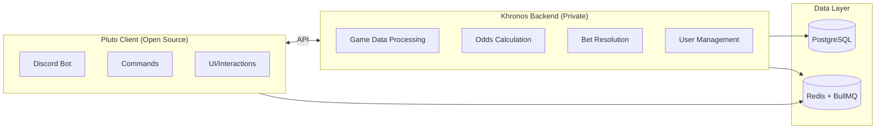

<div align="center">
<a id="top"></a>

<picture>
  <source media="(prefers-color-scheme: dark)" srcset="https://i.imgur.com/CupFfgB.png">
  <source media="(prefers-color-scheme: light)" srcset="https://i.imgur.com/CupFfgB.png">
  
</picture>

# ✨ Pluto

### Sports betting without leaving Discord

*Virtual sports betting for the world's largest sports communities*

[](https://www.typescriptlang.org/)
[](https://discord.js.org/)
[](LICENSE)
[](https://github.com/fearandesire/Pluto-Betting-Bot/releases)

[Documentation](https://docs.pluto.fearandesire.com)
[Support on Patreon](https://www.patreon.com/fenix_/posts)
[Report Bug](https://github.com/fearandesire/Pluto-Betting-Bot/issues)

</div>

---

## Table of Contents

1. [✨ Pluto](#-pluto)
      1. [Sports betting without leaving Discord](#sports-betting-without-leaving-discord)
   1. [Table of Contents](#table-of-contents)
   2. [About](#about)
   3. [Features](#features)
      1. [Betting](#betting)
      2. [Stats \& Competitive](#stats--competitive)
   4. [Communities](#communities)
   5. [Architecture](#architecture)
   6. [Tech Stack](#tech-stack)
   7. [Getting Started](#getting-started)
      1. [Prerequisites](#prerequisites)
      2. [Installation](#installation)
   8. [Documentation](#documentation)
   9. [Contributing](#contributing)
      1. [Contributors](#contributors)
   10. [License](#license)
   11. [Support](#support)

---

## About

**Pluto** is a production-grade sports betting application built for Discord. It powers a fun, easy to interact with app where members can place virtual bets on real NFL & NBA games (H2H, Prop betting) compete on leaderboards, and climb through progression tiers, all with virtual currency in a risk-free environment. All betting uses in-game currency; no real money involved. Users can claim daily currency rewards to keep the action going.

## Features

<table>
<tr>
<td width="50%">

### Betting
- **Game Betting**: Place bets on NFL & NBA matchups
- **Props Betting**: Player prop bets with live markets
- **Live Odds**: Real-time odds from sports data APIs
- **Fully Autonomous**: Bets lock at kickoff, settle on final — zero manual intervention
- **Game Channels**: Dedicated channels auto-created per matchup

</td>
<td width="50%">

### Stats & Competitive
- **Betting Stats**: Comprehensive performance tracking
- **Leaderboards**: Server-wide rankings & competition
- **Progression System**: Earn tiers from Bronze to Diamond
- **Predictions**: Community prediction features

</td>
</tr>
</table>

## Communities

Pluto powers the betting experience for some of Discord's largest sports communities:

| Community | Description |
|-----------|-------------|
| [**NFL Chat**](https://discord.gg/nfl) | One of the largest NFL communities on Discord |
| [**NBA Chat**](https://discord.gg/nba) | Premier destination for NBA discussion |
| [**Fantasy Football Chat**](https://discord.gg/fantasyfootball) | The largest fantasy football community on Discord |

> [!NOTE]
> The hosted version of Pluto is a private bot exclusively serving these partner communities.

## Architecture

Pluto's autonomous betting lifecycle — from odds ingestion to bet settlement — is powered by a distributed microservices architecture:



| Component | Description | Status |
|-----------|-------------|--------|
| **Pluto Client** | Discord bot interface & user interactions | Open Source |
| **Khronos API** | Core backend logic, data processing, business rules | Private |
| **Database** | PostgreSQL for persistent data | Private |
| **Queue** | Redis + BullMQ for async job processing | Private |

> [!NOTE]
> This repository contains only the open-source Discord bot client; backend services remain private.

## Tech Stack

| Category | Technologies |
|----------|-------------|
| **Language** | TypeScript 5.9+ |
| **Runtime** | Node.js 20+ |
| **Framework** | Discord.js 14, Sapphire Framework |
| **Database** | PostgreSQL, Redis |
| **Queue** | BullMQ |
| **API** | OpenAPI, Koa |
| **Logging** | Winston |
| **Build** | SWC, pnpm |
| **Deploy** | Docker |

## Getting Started

> [!IMPORTANT]
> The open-source Pluto client requires connection to backend services (Khronos API) to function. Running this bot independently requires setting up your own backend infrastructure.

### Prerequisites

- Node.js 20.x or higher
- pnpm 8.x or higher
- Redis instance
- PostgreSQL database
- Discord Bot Token

### Installation

```bash
# Clone the repository
git clone https://github.com/fearandesire/Pluto-Betting-Bot.git

# Navigate to the project
cd Pluto-Betting-Bot

# Install dependencies
pnpm install

# Set up environment variables
cp .env.example .env
# Edit .env with your configuration

> [!TIP]
> Ensure all required environment variables are configured in `.env` before building. See the documentation for a complete list of configuration options.

# Build the project
pnpm build

# Start the bot
pnpm start
```

<details>
<summary>Development Commands</summary>

```bash
# Development mode with hot reload
pnpm dev

# Watch mode (build only)
pnpm watch

# Run linter
pnpm lint

# Generate API client from OpenAPI spec
pnpm ci-gen-api

# Create a new release
pnpm release
```
</details>

## Documentation

For comprehensive guides, API references, and configuration details:

**[Pluto Documentation](https://docs.pluto.fearandesire.com)**

## Contributing

Contributions are welcome. Any contributions you make are appreciated.

1. Fork the Project
2. Create your Feature Branch (`git checkout -b feature/AmazingFeature`)
3. Commit your Changes (`git commit -m 'Add some AmazingFeature'`)
4. Push to the Branch (`git push origin feature/AmazingFeature`)
5. Open a Pull Request

### Contributors

Authored by [fearandesire](https://github.com/fearandesire)

<a href="https://github.com/fearandesire/Pluto-Betting-Bot/graphs/contributors">
  
</a>

## License

This project is licensed under the **MIT License**. See the [LICENSE](LICENSE) file for details.

## Support

If you find Pluto valuable, consider supporting its development:

<div align="center">

[](https://www.patreon.com/fenix_/posts)

</div>

---

<a href="#top">Back to Top</a>

</div>
